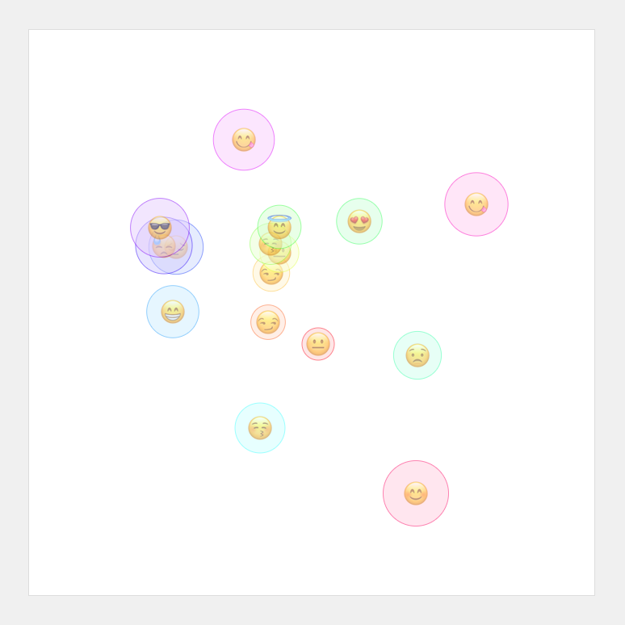

# WASM Go Canvas
A wasm golang demo and toy.

## Running the demo
- run `make`
- visit http://127.0.0.1:8001/

The page should look something like this:

## Contributing
Please fork and submit a PR.

